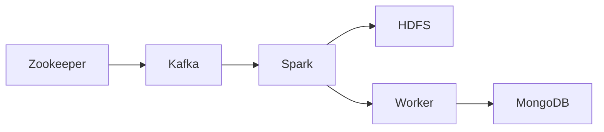

# Big Data Processing Pipeline

[](https://github.com)

## Overview
This project sets up a complete big data processing pipeline using Docker containers. It includes Kafka for stream processing, Hadoop HDFS for distributed storage, Apache Spark for data processing, and MongoDB for data persistence.

## Architecture


## Services

### Message Broker
- **Zookeeper** (Port: 2181)
  - Coordination service for distributed systems
  - Uses `wurstmeister/zookeeper` image

- **Kafka** (Port: 9092)
  - Distributed event streaming platform
  - Depends on Zookeeper
  - Uses `wurstmeister/kafka` image

### Storage
- **HDFS NameNode** (Port: 9870)
  - Hadoop Distributed File System manager
  - Uses `bde2020/hadoop-namenode` image
  - Persistent volume: `hdfs_namenode`

- **HDFS DataNode** (Port: 9864)
  - HDFS storage node
  - Depends on NameNode
  - Uses `bde2020/hadoop-datanode` image
  - Persistent volume: `hdfs_datanode`

### Processing
- **Spark Master** (Ports: 8080, 7077)
  - Spark cluster manager
  - Uses `bitnami/spark` image
  - Web UI available at port 8080

- **Spark Worker**
  - Spark processing node
  - Connects to Spark Master
  - Uses `bitnami/spark` image

### Database
- **MongoDB** (Port: 27017)
  - Document database
  - Persistent volume: `mongo_data`

## Getting Started

1. Clone the repository:
```bash
git clone <repository-url>
cd <repository-name>
```

2. Start the services:
```bash
docker-compose up -d
```

3. Verify services are running:
```bash
docker-compose ps
```

4. Access service UIs:
- Spark Master: http://localhost:8080
- HDFS NameNode: http://localhost:9870
- MongoDB: mongodb://localhost:27017

## Configuration
All service configurations are defined in `docker-compose.yml`:
- All services have automatic restart enabled
- Proper dependency chains configured
- Persistent volumes for HDFS and MongoDB
- Exposed ports for external access

## Requirements
- Docker
- Docker Compose
- Minimum 8GB RAM
- 20GB free disk space

## License
This project is licensed under the MIT License - see the LICENSE file for details.